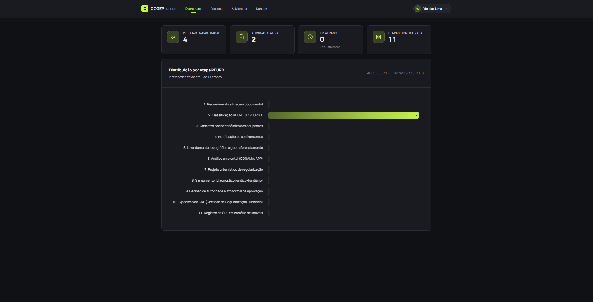
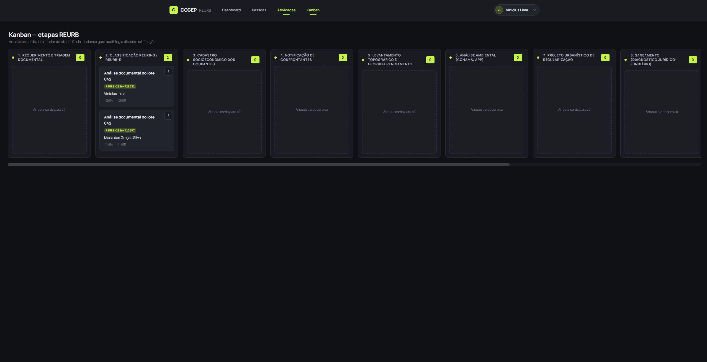
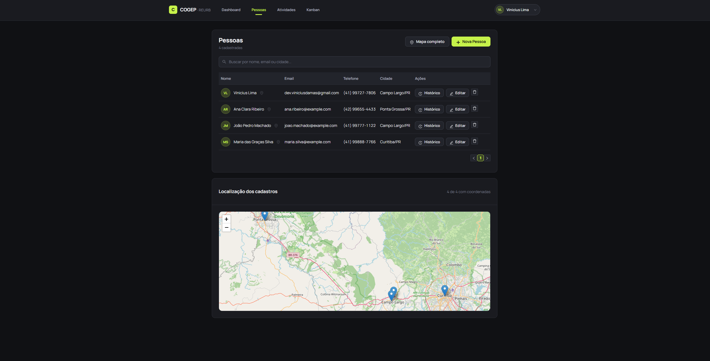
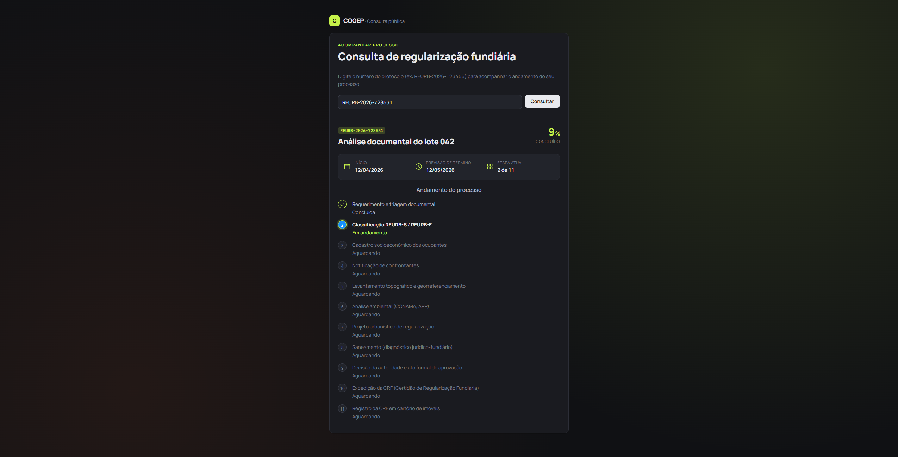
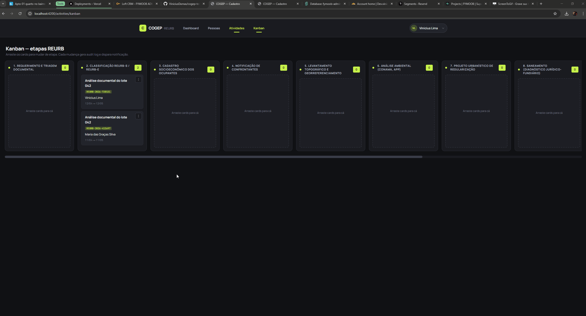
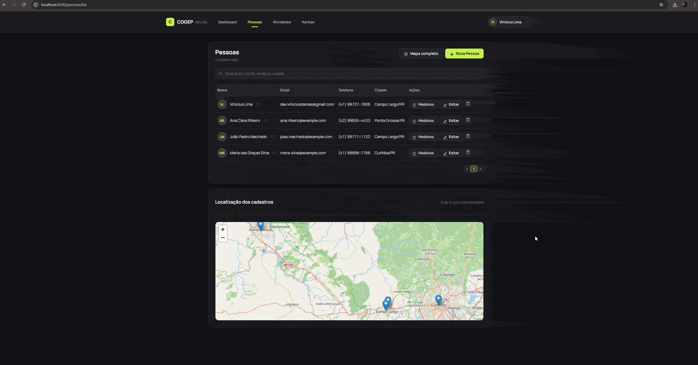
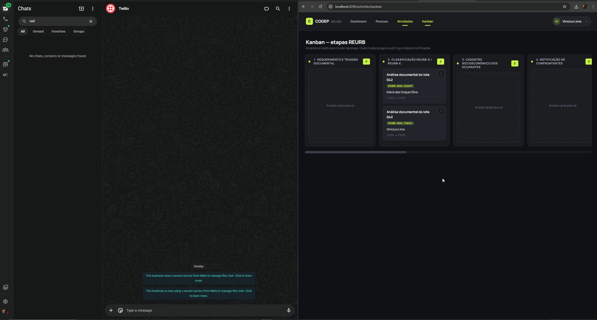

# COGEP — Teste Técnico Full-Stack

Aplicação web de cadastro de **pessoas** e **atividades** com autenticação JWT, construída como teste técnico para a COGEP.

> **Inspiração de domínio**: usei o contexto de Regularização Fundiária Urbana (REURB) da COGEP como estudo de caso para me familiarizar com o negócio. As "atividades" são modeladas como etapas configuráveis de um processo REURB — uma forma de demonstrar arquitetura escalável aplicada ao domínio real do cliente.
>
> **Assets visuais**: paleta e tipografia inspiradas em [cogep.eng.br](https://cogep.eng.br) — todos os elementos gráficos (marca, logos, ícones) são de autoria própria para este projeto.

---

## Demonstração visual

### Telas principais

| Dashboard | Kanban REURB |
|---|---|
|  |  |

| Lista de Pessoas + mini mapa | Consulta pública por protocolo |
|---|---|
|  |  |

### Interações em movimento

**Kanban — drag-and-drop entre etapas REURB com auto-scroll**



**Mapa — clique no nome da pessoa anima zoom até o pin**



**Notificação WhatsApp ao mover card no Kanban (Twilio)**



---

## Stack

- **Backend**: Node.js 20 + Express + TypeScript + Sequelize + PostgreSQL 16 + JWT + Zod + axios
- **Frontend**: Angular 17 + NgZorro (Ant Design) + Bootstrap 5 + Chart.js + Leaflet + Angular CDK
- **Banco**: PostgreSQL 16
- **Notificação WhatsApp**: Twilio API (provider pluggable + fallback ANATEL legado)
- **Testes**: Jest + Supertest (back) + Jasmine/Karma (front)
- **Qualidade**: ESLint + Prettier + Husky (pre-commit/pre-push com lint-staged)
- **CI**: GitHub Actions (lint + testes + build em cada push/PR)

---

## Como executar

### Opção A — Docker Compose (recomendado)

```bash
docker compose up --build
```

Sobe Postgres + backend (porta 3000) + frontend (porta 4200) + seed automático das 11 etapas REURB.

**Notificações WhatsApp reais** (Twilio Sandbox) — copie o template da raiz e preencha:

```bash
cp .env.example .env
# edite .env preenchendo TWILIO_ACCOUNT_SID e TWILIO_AUTH_TOKEN
docker compose up -d backend   # reinicia para ler as novas envs
```

Sem essas credenciais, o backend usa `MockProvider` (loga a mensagem no stdout) — ideal para dev/CI e 100% funcional para avaliação do fluxo de Kanban.

### Opção B — Local

Requisitos: Node 20+, PostgreSQL 16, npm.

```bash
# Backend
cd backend
cp .env.example .env
npm install
npm run seed           # popula reurb_stages com as 11 sub-etapas (Art. 28, Lei 13.465/2017)
npm run dev

# Frontend (em outro terminal)
cd frontend
npm install
npm start
```

Acesse `http://localhost:4200`.

---

## Funcionalidades

### Requisitos obrigatórios (do PDF)

- Autenticação JWT com auto-cadastro (tabela `users` própria, não OAuth)
- CRUD de Pessoas (nome, telefone com máscara BR, email, endereço completo com CEP)
- CRUD de Atividades (nome, descrição, datas, etapa)
- Testes unitários (serviços + componentes)
- Clean architecture + lazy loading

### Diferenciais implementados

#### Core do domínio
- **Kanban drag-and-drop das etapas REURB** configurável via tabela `reurb_stages` (não hard-coded). Angular CDK + auto-scroll horizontal proporcional à proximidade da borda ao arrastar cards.
- **Menu de ação rápida por card** (⋯): alternativa ao drag — dropdown com todas as etapas pra mover em 1 clique.
- **Geocoding automático** em cadeia: ViaCEP (CEP → endereço) + Nominatim/OSM (endereço → lat/lon).
- **Mapa Leaflet** full-screen com pins das pessoas + mini mapa embutido na lista de Pessoas.
- **Clique no nome da pessoa = fly-to no mapa**: anima o zoom até o ponto e abre o popup.
- **Audit log** via hooks Sequelize (`beforeUpdate`, `afterCreate`, `afterDestroy`) — quem fez, quando, diff legível. Drawer resolve UUIDs (etapa, pessoa) para nomes em português.

#### Dashboard B2G
- 4 KPIs com ícones em badge accent (Pessoas, Atividades, Em Atraso, Etapas) — cartão "Em atraso" muda visual (borda vermelha + gradiente) quando há atividades vencidas.
- Gráfico horizontal (Chart.js) com barras em gradiente verde neon, valor inline na ponta, tooltip com percentual, ghost bars para etapas vazias.

#### Consulta pública (B2C)
- Rota `/consulta/:protocolo` **sem autenticação** — o cidadão digita o protocolo REURB e vê em qual etapa está seu processo (stepper vertical com etapas concluídas/em andamento/aguardando).
- Resolve a dor real de famílias beneficiadas que não sabem status do processo sem ligar na prefeitura.

#### Status visual de atividades
- Badge colorido na lista com 3 estados: **No prazo** (verde), **Vencendo** (laranja, ≤7 dias), **Em atraso** (vermelho) — calculado a partir do `endDate`.
- Protocolo na lista é um link clicável que abre a consulta pública em nova aba.
- Mini-kanban preview embaixo da tabela com 10 colunas compactas (até 3 cards por etapa + "+ N mais").

#### Notificações WhatsApp
- Toda mudança de etapa dispara mensagem pro titular do processo, com link da consulta pública.
- Provider pluggable (MockProvider / TwilioProvider) — seleção via env.
- **Polling de status pós-POST** (até 4s) detecta falhas assíncronas do Twilio (error 63015).
- **Fallback automático para formato BR legado**: se o número no formato novo ANATEL (+55 DDD 9XXXX-XXXX) falha com 63015, o backend retry com o formato antigo (+55 DDD XXXX-XXXX) — resolve usuários com contas WhatsApp criadas antes de 2012.

#### UX/UI
- **Tema dark sofisticado**: preto soft `#101114`, tipografia Manrope variável, verde neon `#c6f24a` só em pontos de destaque (CTA, valor selecionado, acentos).
- **Hierarquia de botões**: ações primárias em verde accent (Nova Pessoa, Salvar), secundárias em dark, destrutivas apenas com ícone vermelho.
- **Dropdown do usuário no header**: avatar com iniciais + nome + menu com email + logout.
- **Indicador de menu ativo**: barra curta (24px) abaixo do item, estilo moderno (padrão Linear/Vercel).
- **Avatares com iniciais** em lista de Pessoas e Atividades (círculos verdes discretos).
- **Filtros e busca**: pessoas filtra por nome; atividades tem busca (protocolo/nome/pessoa) + select de etapa.
- **Máscara de telefone ao digitar**: `(DDD) 9XXXX-XXXX` em tempo real, regex-validated no backend.
- **Ícones registrados via NZ_ICONS**: tree-shakeable, renderizam offline.

#### Infraestrutura
- **Normalização de texto**: UTF-8 NFC + rejeição de caracteres de substituição (U+FFFD) via Zod em todos os inputs — blinda contra encoding quebrado vindo de bash/curl Windows.
- **Docker Compose** com healthcheck no Postgres + env vars externalizadas.
- **CI GitHub Actions**: lint, test, build em cada push/PR.
- **Husky** pre-commit (lint-staged: prettier + eslint) e pre-push (roda testes).

---

## Arquitetura

### Backend — Clean architecture

```
backend/src/
├── config/         # env (Zod-validated) + Sequelize instance
├── domain/         # types puros (framework-agnostic)
├── models/         # Sequelize models + associations
├── services/       # regra de negócio + validação Zod
├── controllers/    # adaptadores HTTP
├── routes/         # Express (públicas + autenticadas separadas)
├── middlewares/    # auth JWT, error handler
├── utils/          # jwt, errors, protocol, text normalization
└── seeds/          # reurb-stages (11 sub-etapas alinhadas ao Art. 28)
```

Dependência sempre flui para o domínio: `controllers → services → models`.

### Frontend — Feature modules

```
frontend/src/app/
├── core/           # services, guards, interceptors, models
├── shared/         # SharedModule + audit-formatter util
├── layout/         # MainLayout (header com menu + dropdown user)
└── features/       # auth, persons, activities, dashboard, public — cada um lazy loaded
```

### Fluxo da notificação WhatsApp

```
activity.service.moveStage()
  ↓
notification.service.notify(phone, message)
  ↓
Provider (MockProvider | TwilioProvider)
  ↓
POST /Messages.json → Twilio
  ↓
Poll Messages/{sid}.json (1-4s) — detecta falha async
  ↓
(se error 63015) retry com formato legado BR (sem o 9 pós-DDD)
```

### Fluxo de autenticação

```
POST /api/auth/register → cria User (bcrypt 10)
POST /api/auth/login → verifica senha → emite JWT (1d)
JWT no header Authorization: Bearer → authMiddleware valida em rotas protegidas
Interceptor Angular injeta token em toda request
```

### Rotas públicas vs protegidas

**Públicas** (sem auth):
- `POST /api/auth/register`
- `POST /api/auth/login`
- `GET /api/stages` — referência estática, não sensível
- `GET /api/public/consulta/:protocol`

**Protegidas**: demais endpoints (persons, activities, dashboard, audit log, geocoding).

---

## Decisões técnicas

### Por que modelar "atividade" como etapa REURB?

A COGEP é empresa de regularização fundiária. Modelar "atividade" como processo com etapa configurável demonstra:

1. Arquitetura escalável — etapas em tabela, customizáveis por município
2. Trilha de auditoria — requisito legal em cadastros fundiários
3. Compreensão do contexto do cliente da COGEP (prefeituras)

Os campos obrigatórios do PDF (nome, descrição, datas) são mantidos — o `stage_id` é um campo adicional que não quebra o contrato mínimo.

### Clean architecture + injeção de dependências simples

Sem framework de DI externo no backend. Services são funções exportadas, importadas pelos controllers. Zero magia, fácil de testar, claro pra quem lê.

### Lazy loading Angular

Cada feature (`auth`, `persons`, `activities`, `dashboard`, `public`) é um `NgModule` carregado via `loadChildren` — reduz bundle inicial e isola features.

### Provider pattern para notificações

`NotificationProvider` como interface com duas implementações (`MockProvider`, `TwilioProvider`) e fábrica baseada em env. Troca de provider = 1 linha. Preparado para Evolution API, SendGrid, Firebase, etc.

### Por que Leaflet e não Google Maps?

Leaflet + OpenStreetMap é gratuito, open-source e padrão em geotecnologia. A COGEP já usa georreferenciamento — escolha coerente com o stack deles.

### Audit log sem biblioteca externa

Hooks do Sequelize (`beforeUpdate`, `afterCreate`, `afterDestroy`) gravam diff em `audit_logs` com association ao usuário (`changedByUser`). Drawer no frontend formata os logs resolvendo UUIDs (etapa, pessoa) para nomes legíveis.

### ViaCEP + Nominatim

- ViaCEP (gratuito, sem auth) preenche endereço a partir do CEP
- Nominatim (OSM) devolve lat/lon — rate limit de 1 req/s
- O backend **omite o CEP** na query do Nominatim porque esse campo confunde o geocoder e retorna 0 resultados em muitos endereços válidos.

### Fallback de formato WhatsApp

Números BR pré-ANATEL 2012 persistem no WhatsApp com 10 dígitos (sem o `9` extra após DDD). O Twilio Sandbox faz match literal da string — enviar pra `+5541997777777` falha com 63015 se o opt-in foi feito com `+554197777777`. Solução:

1. Tenta formato ANATEL correto (11 dígitos com 9)
2. Pollinga Messages/{sid}.json por até 4s
3. Se status terminal = `failed` com code 63015, remove o `9` e retry
4. Em produção real: usar Twilio Lookup API pra cachear o formato canônico

### Normalização de texto (Zod)

Sequelize/Postgres são UTF-8, mas entradas vindas de bash do Windows podem chegar codificadas em Latin-1, gerando caractere de substituição U+FFFD salvo no banco. Solução no Zod schema:

```ts
const safeText = (min, max) =>
  z.string().min(min).max(max)
    .refine(v => !v.includes('\uFFFD'))
    .transform(v => v.normalize('NFC').trim());
```

Rejeita com 400 + normaliza composição Unicode (NFC).

### Shadow fields do Sequelize / TypeScript

O `tsconfig` do backend usa `"useDefineForClassFields": false` porque target `ES2022` inicializa campos de classe com `undefined` sobrescrevendo os getters do Sequelize — era o bug que fazia `user.passwordHash` vir como `undefined` no login. Fix em 1 linha no `tsconfig.json`, sem precisar mexer em todos os modelos.

### Design system custom em CSS variables

Todo o tema dark é baseado em variáveis CSS root (`--c-bg`, `--c-accent`, `--shadow-md`, etc.). Troca de tema = mudar o `:root`. Sem runtime theme switcher, mas preparado para um.

---

## Estrutura completa

```
cogep-teste-tecnico/
├── backend/
│   ├── src/
│   │   ├── config/             # env (Zod) + Sequelize
│   │   ├── domain/             # types puros
│   │   ├── models/             # Sequelize models + associations
│   │   ├── services/           # auth, person, activity, notification, audit, ...
│   │   ├── controllers/        # HTTP handlers
│   │   ├── routes/             # Express routes (públicas + autenticadas)
│   │   ├── middlewares/        # auth, error handler
│   │   ├── utils/              # jwt, errors, protocol, text normalization
│   │   └── seeds/              # reurb-stages seed
│   └── tests/                  # Jest + Supertest
├── frontend/
│   └── src/app/
│       ├── core/               # services, guards, interceptors, models
│       ├── shared/             # SharedModule + audit-formatter util
│       ├── layout/             # MainLayout (header + nav + user dropdown)
│       └── features/
│           ├── auth/           # login + register (lazy)
│           ├── persons/        # CRUD + list + mini mapa (lazy)
│           ├── activities/     # CRUD + list + kanban + mini kanban (lazy)
│           ├── dashboard/      # KPIs + chart (lazy)
│           └── public/         # consulta por protocolo (lazy, sem auth)
├── docker-compose.yml
├── .github/workflows/ci.yml
├── .husky/                     # pre-commit + pre-push
├── .env.example                # vars consumidas pelo docker-compose (Twilio)
├── PESQUISA_DE_DOMINIO.md      # contexto REURB + decisões técnicas
└── README.md
```

---

## Testes

```bash
# Backend (Jest)
cd backend && npm test

# Frontend (Jasmine/Karma)
cd frontend && npm test -- --watch=false
```

CI roda os dois em cada push/PR.

---

## Endpoints principais

| Método | Rota                                    | Auth | Descrição                                |
|--------|-----------------------------------------|------|------------------------------------------|
| POST   | `/api/auth/register`                    | não  | Cria usuário                             |
| POST   | `/api/auth/login`                       | não  | Emite JWT                                |
| GET    | `/api/auth/me`                          | sim  | Dados do usuário logado                  |
| GET    | `/api/stages`                           | não  | Lista as 11 sub-etapas REURB             |
| GET    | `/api/persons`                          | sim  | Lista pessoas                            |
| POST   | `/api/persons`                          | sim  | Cria pessoa (geocoding automático)       |
| PUT    | `/api/persons/:id`                      | sim  | Atualiza pessoa                          |
| DELETE | `/api/persons/:id`                      | sim  | Remove pessoa                            |
| GET    | `/api/persons/:id/history`              | sim  | Audit log da pessoa                      |
| GET    | `/api/geocoding/cep/:cep`               | sim  | ViaCEP proxy                             |
| GET    | `/api/activities`                       | sim  | Lista atividades                         |
| POST   | `/api/activities`                       | sim  | Cria atividade + gera protocolo          |
| PUT    | `/api/activities/:id`                   | sim  | Atualiza atividade                       |
| PATCH  | `/api/activities/:id/stage`             | sim  | Move etapa (dispara notificação)         |
| DELETE | `/api/activities/:id`                   | sim  | Remove atividade                         |
| GET    | `/api/activities/:id/history`           | sim  | Audit log da atividade                   |
| GET    | `/api/dashboard/summary`                | sim  | KPIs + funil por etapa                   |
| GET    | `/api/public/consulta/:protocol`        | não  | Consulta pública por protocolo           |

---

## Próximas iterações (roadmap)

1. **Twilio Lookup API** — cachear formato canônico do WhatsApp por pessoa (elimina retry)
2. **PostGIS + `ST_Intersects`** — detecção de sobreposição de polígonos de lotes
3. **PWA offline-first** — coleta de cadastros em campo sem conexão
4. **Integração ONR** — registro em cartório de imóveis
5. **OCR + LLM** — validação automática de comprovantes (Tesseract + modelo multimodal)
6. **Cobertura E2E** — Playwright/Cypress
7. **Service Worker** — push notifications nativas complementando WhatsApp
8. **Export PDF** — gerar certidão CRF digital (etapa 9 do REURB) com assinatura digital
